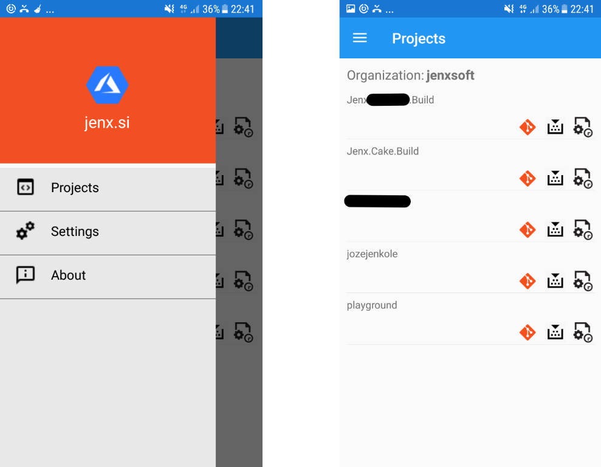

# Jenx Azure DevOps Xamarin (iOS & Android) Client

## The purpose of this repository.
* Just playing with Xamarin Forms. 
	* Playing aroud with Visual (Material design for Xamarin Forms).	 
	
* Playing around with just released Visual Studio 2019.

## Domain 

* App can do basic Azure DevOps functions, like:
	* list Azure DevOps projects in organization,
	* list Azure DevOps repositories,
	* list Azure Build definitions and builds,
	* trigger new Build.

* First, you need to put Organization name and personal token into Settings page in order to have access to your Azure DevOps backend.

## How to Engage, Contribute and Provide Feedback

Feel free to comment, play around with the app and fix issues.